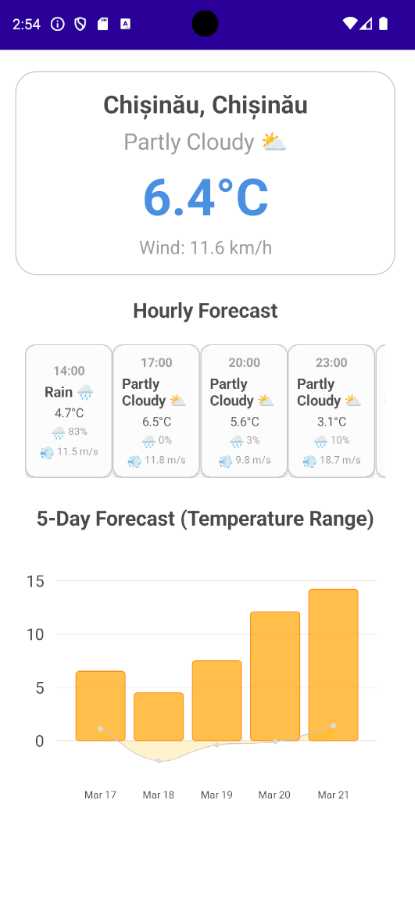

# WeatherApp
WeatherApp is a cross-platform weather application built using .NET MAUI. It fetches weather data from the OpenMeteo API and displays it in a user-friendly interface.



## Features

- Fetches current weather data and forecasts from the OpenMeteo API based on your current location.
- Displays weather information in a user-friendly interface.
- Supports multiple platforms including Android, iOS, MacCatalyst, and Windows.

## Getting Started

### Prerequisites
- Visual Studio 2022 with .NET MAUI workload installed

### Installation

1. Clone the repository:
    ```sh
    git clone https://github.com/kennshi01/MauiWeatherApp.git
    ```
2. **Open the solution file `MauiWeatherApp.sln` in Visual Studio and run project through your desired machine(preferrably Android)**.